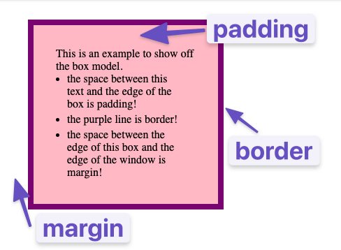

## What is the box model?
- Every element on a webpage is a rectangular box
- The box model describes the layout of the box
- The box model consists of the content, padding, border, and margin

### What is padding?
- Increases space between border of a box and the content of a box

### What is border?
- Adds space between the margin and the padding

### What is margin?
- Increases space between the border of a box and the border of adjacent boxes



### From inside to outside, what is the order of box-model properties?
Order of box-model properties (from inside to outside):
- Content
- Padding
- Border
- Margin

### What is box-sizing?
- Determines how the width and height of a box are calculated
- `content-box` (default): width and height apply to the content area only
- `border-box`: width and height apply to the content area, padding, and border

Example:
```css
.box {
  box-sizing: border-box;
}
```

## What is the difference between the standard and alternative box model?
- The standard box model (box-sizing: content-box) adds padding and border **outside of the content's specified width and height**, which can lead to unexpected total sizes.
- The alternative box model (box-sizing: border-box) includes padding and borders **within the specified width and height**, so the overall size remains consistent.

## Would you use margin or padding to create more space between 2 elements?
- Margin: used to create space between two elements

## Would you use margin or padding to create more space between the contents of an element and its border?
- Padding: used to create space between the contents of an element and its border

## Would you use margin or padding if you wanted two elements to overlap each other?
- Margin: can be used with negative values to make elements overlap

## How do you set the alternative box model for all of your elements?
```css
* {
  box-sizing: border-box;
}
```

## How do you center an element horizontally?
- Inline elements: `text-align: center;`
- Block elements: `margin: 0 auto;`
- Block elements in flex container: `justify-content: center;`

## How do modify the box calculation?

### What are the two box types?
- Block: takes up **full width of parent container**, height depends on content, and margin and padding can be modified
- Inline: only takes up **as much width as necessary**, height depends on content, and margin and padding can be modified

### Block vs Inline
#### Block
- Default style 
```css
display: block;
```
- elements appear stacked on top of each other
- new elements appear on new line
#### Inline
```css
display: inline;
```
- elements appear on same line
- new elements appear on same line
- width and height cannot be modified
- e.g. `<span>`, `<a>`, ``
- do not want to put extra padding or margin on inline elements 

### Inline-block
```css
display: inline-block;
```
- elements appear on same line
- in practice, use Flexbox

### Divs and spans
- `<div>`: block-level element, used for grouping elements together
- `<span>`: inline-level element, used for styling small pieces of content
- can be used as hook elements for styling
- Example:
```html
<div class="container">
</div>
```
```css
.container {
  /* any kind of styling */
}
```
#### What is normal flow in css?
- Normal flow is the default layout behavior of elements in a web page.
- In normal flow, block-level elements are stacked vertically, one after the other, taking up the full width available.
- Inline elements are placed next to each other horizontally, wrapping to the next line if necessary.
- Normal flow can be altered using CSS properties like `float`, `position`, and `display`.
