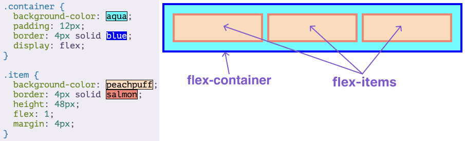

# Flexbox 

## What is flexbox?
- arrange items into rows or columns
- items will flex (grow or shrink) to fill available space

```css
.flex-container {
  display: flex;
}
```

## What are flex containers and flex items?
- flex container: parent element that contains flex items
- flex item: child elements of flex container


## What is the flex shorthand property?
- `flex` is shorthand for `flex-grow`, `flex-shrink`, and `flex-basis`
```css
.div {
  flex:1;
}
/* equivalent to */
.div2{
    flex-grow:1,
    flex-shrink:1,
    flex-basis:0
}
```

## What is flex-grow?
- determines how much a flex item will grow relative to the rest of the flex items in the container
- default is 0, which means the item will not grow
- if all items have `flex-grow:1`, they will share the available space equally
- if one item has `flex-grow:2`, it will take up twice as much space as the other items

## What is flex-shrink?
- determines how much a flex item will shrink relative to the rest of the flex items in the container
- default is 1, which means the item will shrink
- if all items have `flex-shrink:1`, they will shrink equally
- if one item has `flex-shrink:2`, it will shrink twice as much as the other items

## What is flex-basis?
- determines the initial size of a flex item
- default is `auto`, which means the item will take up as much space as it needs
- if all items have `flex-basis:100px`, they will all have the same initial size
- if one item has `flex-basis:200px`, it will have a larger initial size than the other items

## What is flex auto?
- shorthand for `flex: 1 1 auto`
- means the item will grow and shrink, and take up as much space as it needs

## What is flex none?
- shorthand for `flex: 0 0 auto`
- means the item will not grow or shrink, and will not take up any more space than its content


# Axes

## What are the 2 axes in flexbox?
- default direction is row
```css
.flex-container {
  flex-direction: column;
  /* main axis is top to bottom */
  /* cross axis is left to right */
}
```
- 2 main axes:
  - main axis: axis along which flex items are laid out
  - cross axis: axis perpendicular to the main axis

```css
.flex-container {
  flex-direction: row;
  /* main axis is left to right */
  /* cross axis is top to bottom */
}
```
Reference: 
https://flexbox.malven.co/

# Alignment

## How to align items in a flex container?
- `justify-content`: aligns items along the main axis
e.g.
```css
justify-content: center;
```
- `align-items`: aligns items along the cross axis
e.g.
```css
align-items: center;
```
- `align-self`: aligns a single item along the cross axis
e.g.
```css
align-self: center;
```

### What is the difference between `justify-content` and `align-items`?
- `justify-content` aligns items along the main axis. Distributes space between and around items.
- `align-items` aligns items along the cross axis

### How do you use flexbox to completely center a `div` inside a flex container?
```css
display: flex;
justify-content: center;
align-items: center;
```
### What’s the difference between `justify-content: space-between` and `justify-content: space-around`?

- `justify-content: space-between` places **equal space** between items but **does not add space at the beginning or end of the container**.
- `justify-content: space-around` distributes equal space around each item. This means that items will have half the space at the edges of the container, and full space between each pair of items in the middle.
